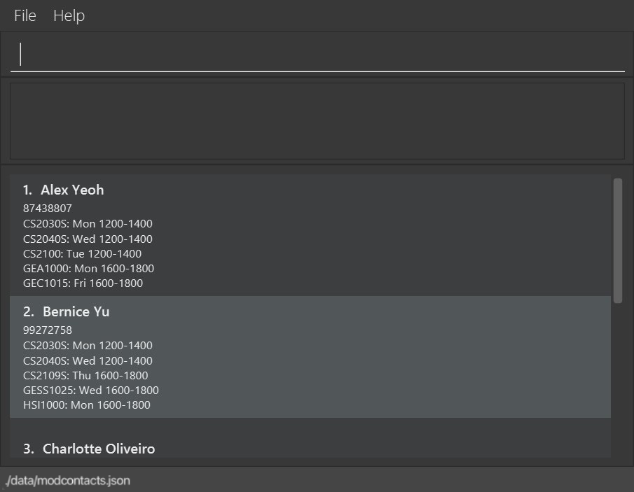

Hello NUS School of Computing (SoC) students! Welcome to the User Guide for **ModContacts**! 

**TIRED** of constantly needing to  remember what your NUS friends are up to?
**ModContacts** is a desktop app for keeping track of your peers and the modules that they take so that you can keep in 
contact with them amidst your journey in NUS!

# Table of Contents
{:toc}

--------------------------------------------------------------------------------------------------------------------

# About ModContacts
## Who is ModContacts for?
ModContacts tailored specifically for:
1. NUS School of Computing students,
2. people who want to keep in touch with their NUS friends easily,
3. people who desire academic success by utilising their social connections,
4. people quick on the keyboard, tired of moving constantly between the mouse and keyboard

## What does ModContacts do?
ModContacts is designed to help School of Computing students:
- Effortlessly keep track of all their friend's modules and schedules
  - Our one-stop solution to keeping track of our friend's timetables!
- Find out common timings when everyone is free to meet
  - Say goodbye to painting when2meets!
- Discover who is taking the same module as you
  - No more constantly asking: "hey bro, what mods are you doing this sem?"

## What is the Purpose of this User Guide?
Some of you are definitely thinking: _What is the point of this User Guide?_ 

The ModContacts User Guide serves as a quick, efficient, all-in-one manual for both new and experienced users.

### New Users
It is great to see that you're interested in using ModContacts!

Head to the [Getting Started](#Getting-Started) section and follow the guide to get ModContacts up and running!

Then check out some [Features](#Features), and the handy [Command Summary](#command-summary).

### Experienced Users

Head over to the [Command Summary](#command-summary), [FAQ](#faq) or [Troubleshooting](#known-issues) sections.

## How should I use this guide?

includes information on how users can effectively navigate the document, clarifies the meaning of icons and formatting used, and provides guidance on understanding features, functions, or commands.


[Back to Table of Contents](#Table-of-Contents)

---

# Getting Started

## Prerequisites

For ModContacts to work, you need to have Java `11` or above installed on your computer!

Follow this guide for your OS of choice:
- [Windows](https://docs.oracle.com/en/java/javase/11/install/installation-jdk-microsoft-windows-platforms.html#GUID-A7E27B90-A28D-4237-9383-A58B416071CA)
- [MacOS](https://docs.oracle.com/en/java/javase/11/install/installation-jdk-macos.html#GUID-2FE451B0-9572-4E38-A1A5-568B77B146DE)
- [Linux](https://docs.oracle.com/en/java/javase/11/install/installation-jdk-linux-platforms.html#GUID-737A84E4-2EFF-4D38-8E60-3E29D1B884B8)

## Quick start

1. Ensure you have Java `11` or above installed in your computer from the [Prerequisites](#Prerequisites) Section.

2. Download the latest `modcontacts.jar` from [here](https://github.com/AY2324S2-CS2103T-W12-2/tp/releases).

3. Simply double-click on `modcontacts.jar` within your file explorer and a GUI similar to what is shown below should appear!
   

## Usage

Here we will probably have images of modcontacts showing what the command box is, where the data is shown, 
images ideally should have labels and what not. Show a sample command usage, maybe add a student. IMAGES.

### Friends, what are they?
A `Friend` is a person that you want to keep contact with in school! This is pretty intuitive as there is no distinction between the term that we use in ModContacts and the term that is used in real life.
### Modules, what are they?
A `Module` refers to the modules that you take during a semester in NUS. They have **Module Codes** (e.g **MA2001** Linear Algebra I) to identify them.


### So what now?
Since you know what a `Module` and a `Friend` is, you are one step closer to being a master at using ModContacts to add your `Friend`, and also add a `Module` to your `Friend`!

Let's get down to how we can write commands to add them!

### What is a Command?

A command is what you type into the app to execute your intentions (Adding a `Friend` or a `Module`)!

Here are some examples of commands that you'd be using:

* `add n/Aditya p/98765432`

* `add_module i/1 m/MA2001`

* `delete_module i/2 m/CS1231S`

You may notice a pattern here, and here is a rough breakdown of what a command composes of. Let's use the first example!
```
add n/Aditya p/98765432
```
Our command composes of:

1. A Command Word (`add`)

   This is the first word of your command that carries the intention of your action! Examples would be using `add` when you want to add a `Friend`, `add_module` when you want to add a `Module` to your `Friend`, so on and so forth!

2. Prefixes (`n/Aditya p/98765432`)

   Prefixes are additional information that you add to your command. For example, when adding a friend you would want to add their **name** and their **email**.

   We can use Prefixes to accomplish this! They are usually marked with an unique identifier (`n/` for **name** and `p/` for **phone number**). You can then add your values after the identifiers! (`Aditya` is the value supplied for the **name** when you type `n/Aditya`).

   **(P.S)** Different commands have different prefixes! Check out the **[Features](#Features)** section to see what prefixes exist for each command.


### Summary
In summary, what this command (`add n/Aditya p/98765432`) does is that it adds a `Friend` whose name is `Aditya` and whose email is `e123456@u.nus.edu`.

<div markdown="block" class="alert alert-info">

**:information_source: Notes about the command format:**<br>

* Words in `UPPER_CASE` are the parameters to be supplied by the user.<br>
  e.g. in `add n/NAME`, `NAME` is a parameter which can be used as `add n/John Doe`.

* Items in square brackets are optional.<br>
  e.g `n/NAME [t/TAG]` can be used as `n/John Doe t/friend` or as `n/John Doe`.

* Items with `…`​ after them can be used multiple times including zero times.<br>
  e.g. `[t/TAG]…​` can be used as ` ` (i.e. 0 times), `t/friend`, `t/friend t/family` etc.

* Parameters can be in any order.<br>
  e.g. if the command specifies `n/NAME p/PHONE_NUMBER`, `p/PHONE_NUMBER n/NAME` is also acceptable.

* Extraneous parameters for commands that do not take in parameters (such as `help`, `list`, `exit` and `clear`) will be ignored.<br>
  e.g. if the command specifies `help 123`, it will be interpreted as `help`.

* If you are using a PDF version of this document, be careful when copying and pasting commands that span multiple lines as space characters surrounding line-breaks may be omitted when copied over to the application.
</div>

Refer to the [Features](#features) below for details of each command.
 
[Back to Table of Contents](#Table-of-Contents)

--------------------------------------------------------------------------------------------------------------------

# Features

[//]: # (### Viewing help : `help`)

[//]: # ()
[//]: # (Shows a message explaning how to access the help page.)

[//]: # ()
[//]: # (![help message]&#40;images/helpMessage.png&#41;)

[//]: # ()
[//]: # (Format: `help`)


## Adding a student: `add`

Adds a student to the address book.

Format: `add n/NAME p/PHONE_NUMBER e/EMAIL a/ADDRESS [t/TAG]…​`

<div markdown="span" class="alert alert-primary">:bulb: **Tip:**
A student can have any number of tags (including 0)
</div>

Examples:
* `add n/John Doe p/98765432 e/johnd@example.com a/John street, block 123, #01-01`
* `add n/Betsy Crowe t/friend e/betsycrowe@example.com a/Newgate Prison p/1234567 t/criminal`

## Listing all students : `list`

Shows a list of all students in the address book.

Format: `list`

## Editing a student : `edit`

Edits an existing student in the address book.

Format: `edit INDEX [n/NAME] [p/PHONE] [e/EMAIL] [a/ADDRESS] [t/TAG]…​`

* Edits the student at the specified `INDEX`. The index refers to the index number shown in the displayed student list. The index **must be a positive integer** 1, 2, 3, …​
* At least one of the optional fields must be provided.
* Existing values will be updated to the input values.
* When editing tags, the existing tags of the student will be removed i.e adding of tags is not cumulative.
* You can remove all the student’s tags by typing `t/` without
    specifying any tags after it.

Examples:
*  `edit 1 p/91234567 e/johndoe@example.com` Edits the phone number and email address of the 1st student to be `91234567` and `johndoe@example.com` respectively.
*  `edit 2 n/Betsy Crower t/` Edits the name of the 2nd student to be `Betsy Crower` and clears all existing tags.

## Adding a Module: `add_module`

Adds a module to your friend in the address book.

Format: `add_module i/INDEX m/MODULE_CODE`

* The `INDEX` refers to the index number shown in the displayed student list. The index must be a positive integer 1, 2, 3, ...
* The `MODULE_CODE` refers to the module code of the module you intend to add

<div markdown="span" class="alert alert-primary">:bulb: **Tip:**
  If you are unsure of a module code, you can use <a href="https://www.nusmods.com">NUS Mods</a> to find it!
</div>

## Deleting a Module: `delete_module`

Deletes a module from your friend in the address book.

Format: `delete_module i/INDEX m/MODULE_CODE`

* The `INDEX` refers to the index number shown in the displayed student list. The index must be a positive integer 1, 2, 3, ...
* The `MODULE_CODE` refers to the module code of the module you intend to delete

## Adding a Module Timing: `add_timing`

Adds a module's class timing to your friend in the address book.

Format: `add_timing i/INDEX m/MODULE_CODE d/DAY st/START_TIME et/END_TIME`

* The `INDEX` refers to the index number shown in the displayed student list. The index must be a positive integer 1, 2, 3, ...
* The `MODULE_CODE` refers to the module code of the module you intend to add
* The `DAY` refers to the day of the class, i.e. Mon, Tue, Wed, Thu, Fri, Sat, Sun
* The `START_TIME` refers to the start time of the class i.e. 0800, 1230, 1845, 2300
* The `END_TIME` refers to the end time of the class i.e. 0900, 1430, 2045, 2359

## Deleting a Module Timing: `delete_timing`

Deletes a module's class timing from your friend in the address book.

Format: `delete_timing i/INDEX m/MODULE_CODE d/DAY st/START_TIME`

* The `INDEX` refers to the index number shown in the displayed student list. The index must be a positive integer 1, 2, 3, ...
* The `MODULE_CODE` refers to the module code of the module you intend to add
* The `DAY` refers to the day of the class, i.e. Mon, Tue, Wed, Thu, Fri, Sat, Sun
* The `START_TIME` refers to the start time of the class i.e. 0800, 1230, 1845, 2300


## Locating students by name: `find`

Finds students whose names contain any of the given keywords.

Format: `find KEYWORD [MORE_KEYWORDS]`

* The search is case-insensitive. e.g `hans` will match `Hans`
* The order of the keywords does not matter. e.g. `Hans Bo` will match `Bo Hans`
* Only the name is searched.
* Only full words will be matched e.g. `Han` will not match `Hans`
* Students matching at least one keyword will be returned (i.e. `OR` search).
  e.g. `Hans Bo` will return `Hans Gruber`, `Bo Yang`


## Find students who are free to meet: `find_free_time`

Finds students who are free at this given time period.

Format: `find_free_time d/DAY st/START_TIME et/END_TIME`

* The `DAY` refers to the day of the class, i.e. Mon, Tue, Wed, Thu, Fri, Sat, Sun
* The `START_TIME` refers to the start time of the class i.e. 0800, 1230, 1845, 2300
* The `END_TIME` refers to the end time of the class i.e. 0900, 1430, 2045, 2359


## Learn more about modules: `list_modules`

Gets more information on the modules in ModContacts.

Format: `list_modules m/MODULE_CODE`

* The `MODULE_CODE` refers to the module code of the module you intend to add


## Deleting a student : `delete`

Deletes the specified student from the address book.

Format: `delete INDEX`

* Deletes the student at the specified `INDEX`.
* The index refers to the index number shown in the displayed student list.
* The index **must be a positive integer** 1, 2, 3, …​

Examples:
* `list` followed by `delete 2` deletes the 2nd student in the address book.
* `find Betsy` followed by `delete 1` deletes the 1st student in the results of the `find` command.

## Clearing all entries : `clear`

Clears all entries from the address book.

Format: `clear`

## Exiting the program : `exit`

Exits the program.

Format: `exit`

--------------------------------------------------------------------------------------------------------------------

## FAQ

**Q**: How do I transfer my data to another Computer?<br>
**A**: Install the app in the other computer and overwrite the empty data file it creates with the file that contains the data of your previous AddressBook home folder.

**Q**: How do I know if my data is saved?<br>
**A**: AddressBook data are saved in the hard disk automatically after any command that changes the data. There is no need to save manually.

**Q**: Can I manually edit the data file?<br>
**A**: AddressBook data are saved automatically as a JSON file `[JAR file location]/data/addressbook.json`. Advanced users are welcome to update data directly by editing that data file.

<div markdown="span" class="alert alert-warning">:exclamation: **Caution:**
If your changes to the data file makes its format invalid, AddressBook will discard all data and start with an empty data file at the next run. Hence, it is recommended to take a backup of the file before editing it.<br>
Furthermore, certain edits can cause the AddressBook to behave in unexpected ways (e.g., if a value entered is outside of the acceptable range). Therefore, edit the data file only if you are confident that you can update it correctly.
</div>

--------------------------------------------------------------------------------------------------------------------

## Known issues

1. **When using multiple screens**, if you move the application to a secondary screen, and later switch to using only the primary screen, the GUI will open off-screen. The remedy is to delete the `preferences.json` file created by the application before running the application again.

--------------------------------------------------------------------------------------------------------------------

## Command summary

Action | Format, Examples
--------|------------------
**Add** | `add n/NAME p/PHONE_NUMBER e/EMAIL a/ADDRESS [t/TAG]…​` <br> e.g., `add n/James Ho p/22224444 e/jamesho@example.com a/123, Clementi Rd, 1234665 t/friend t/colleague`
**Clear** | `clear`
**Delete** | `delete INDEX`<br> e.g., `delete 3`
**Edit** | `edit INDEX [n/NAME] [p/PHONE_NUMBER] [e/EMAIL] [a/ADDRESS] [t/TAG]…​`<br> e.g.,`edit 2 n/James Lee e/jameslee@example.com`
**Find** | `find KEYWORD [MORE_KEYWORDS]`<br> e.g., `find James Jake`
**List** | `list`
**Help** | `help`
