Hello NUS School of Computing (SoC) students! Welcome to the User Guide for **ModContacts**!

**TIRED** of constantly needing to remember what your NUS friends are up to?
**ModContacts** is a desktop app for keeping track of your peers and the modules that they take so that you can keep in
contact with them amidst your journey in NUS!

<div style="page-break-after: always;"></div>

# Table of Contents

- TOC
{:toc}

---

# About ModContacts

## Who is ModContacts for?

ModContacts tailored specifically for:

1. NUS School of Computing students,
2. people who want to keep in touch with their NUS friends easily,
3. people who desire academic success by utilising their social connections,
4. people quick on the keyboard, tired of moving constantly between the mouse and keyboard

## What does ModContacts do?

ModContacts is designed to help School of Computing students:

- Effortlessly keep track of all their friend's modules and schedules
  - Our one-stop solution to keeping track of our friend's timetables!
- Find out common timings when everyone is free to meet
  - Say goodbye to painting when2meets!
- Discover who is taking the same module as you
  - No more constantly asking: "hey bro, what mods are you doing this sem?"

## What is the Purpose of this User Guide?

Some of you are definitely thinking: _What is the point of this User Guide?_

The ModContacts User Guide serves as a quick, efficient, all-in-one manual for both new and experienced users.

### New Users

It is great to see that you're interested in using ModContacts!

Head to the [Getting Started](#getting-started) section and follow the guide to get ModContacts up and running!

Then check out the [Tutorial](#tutorial) some [Features](#features), and the handy [Command Summary](#command-summary).

### Experienced Users

Head over to the [Command Summary](#command-summary), [FAQ](#faq) or [Troubleshooting](#known-issues) sections.

## How should I use this guide?

The guide includes information on how users can effectively navigate the document, clarifies the meaning of icons and formatting used, and provides guidance on understanding features, functions, or commands.
These can be quickly referenced from the [Table of Contents](#table-of-contents).

## Conventions

| Convention           | Description                                                             |
| -------------------- | ----------------------------------------------------------------------- |
| [Link](#conventions) | These are links to sections within the user guide                       |
| `Command`            | Commands are represented with this text                                 |
| :bulb:               | These are tips that might be useful during the operation of ModContacts |
| :exclamation:        | These are warnings to take note of during the operation of ModContacts  |
| `m/FIELD`            | These are required [fields](#glossary) in a command                     |
| `[i/FIELD]`          | These are optional [fields](#glossary) in a command                     |

---
<div style="page-break-after: always;"></div>
# Getting Started

## Prerequisites

For ModContacts to work, you need to have Java `11` or above installed on your computer!

Follow this guide for your OS of choice:

- [Windows](https://docs.oracle.com/en/java/javase/11/install/installation-jdk-microsoft-windows-platforms.html#GUID-A7E27B90-A28D-4237-9383-A58B416071CA)
- [MacOS](https://docs.oracle.com/en/java/javase/11/install/installation-jdk-macos.html#GUID-2FE451B0-9572-4E38-A1A5-568B77B146DE)
- [Linux](https://docs.oracle.com/en/java/javase/11/install/installation-jdk-linux-platforms.html#GUID-737A84E4-2EFF-4D38-8E60-3E29D1B884B8)
<div style="page-break-after: always;"></div>
## Quick start

1. Ensure you have Java `11` or above installed in your computer from the [Prerequisites](#prerequisites) Section.

2. Download the latest `modcontacts.jar` from [here](https://github.com/AY2324S2-CS2103T-W12-2/tp/releases).

3. Opening the app:
   1. **If you are using Windows:** Simply double-click on `modcontacts.jar` within your file explorer and a GUI similar to what is shown below should appear!
   2. **If you are using MacOS / Linux:** Open a terminal window. Navigate to the folder containing `modcontacts.jar` using the `cd [relative/absolute folder path]` command. Then run `java -jar modcontacts.jar`.

<div markdown="span" class="alert alert-primary">:bulb: **Tip:**
For MacOS and Linux users: If you are new to using the terminal, [this guide](https://riptutorial.com/terminal/example/26023/basic-navigation-commands) may be useful for navigating to the folder in step 3.
</div>

On First launch, the app should look like this:


<!--  -->
<div style="page-break-after: always;"></div>
### Usage


1. Menubar: This is where you will find the `File` and `Help` options.
   1. `File` provides you a menu, which contains an option to exit the app.
   2. `Help` shows you a pop-up, using which you can access the User Guide.
2. [CLI](#glossary) / Input: This is where you enter [commands](#what-is-a-command) to interact with the app.
3. Command output panel: This is where you would see the output of the commmand that you have entered in the CLI.
4. Filtered contact list: This is the main information panel of the app. Here you will see a list of your contacts, that you can filter using commands.
   - Filtering the list is done using commands like [`find`](#locating-friends-by-name-find) and [`find_free_time`](#find-friends-who-are-free-to-meet-find_free_time), which change the filtered contact list by reducing the number of contacts displayed.
   - After this, when you use other commands like [`edit`](#editing-a-friend--edit), the command inputs are based on the contacts that are currently visible in the filtered contact list. You will learn more about this [in a later section.](#features)
5. Name, Number, Module with timings: These are the details for a particular contact in the filtered contact list.

### What is a Command?

A command is what you type into the app to execute your intentions (Adding a `Friend` or a `Module`)!

Here are some examples of commands that you'd be using:

- `add n/Aditya p/98765432 e/adityab4@u.nus.edu a/2 College Ave West, Singapore 138607`

- `add_module i/1 m/MA2001`

- `delete_module i/2 m/CS1231S`

You may notice a pattern here, and here is a rough breakdown of what a command composes of. Let's use the first example!

```
add n/Aditya p/98765432 e/adityab4@u.nus.edu a/2 College Ave West, Singapore 138607
```

Our command composes of:

1. A Command Word (`add`)

   This is the first word of your command that carries the intention of your action! Examples would be using `add` when you want to add a `Friend`, `add_module` when you want to add a `Module` to your `Friend`, so on and so forth!

2. Prefixes (`n/Aditya p/98765432 e/adityab4@u.nus.edu a/2 College Ave West, Singapore 138607`)

   Prefixes are additional information that you add to your command. For example, when adding a friend you would want to add their **name** and their **email**.

   We can use Prefixes to accomplish this! They are usually marked with an unique identifier (`n/` for **name**, `p/` for **phone number**, etc). You can then add your values after the identifiers! (`Aditya` is the value supplied for the **name** when you type `n/Aditya`).

   **(P.S)** Different commands have different prefixes! Check out the **[Features](#features)** section to see what prefixes exist for each command.
<div style="page-break-after: always;"></div>
### Summary

In summary, what this command (`add n/Aditya p/98765432 e/adityab4@u.nus.edu a/2 College Ave West, Singapore 138607`)
does is that it adds a `Friend` whose name is `Aditya`, has a phone number `98765432`, has an email is `adityab4@u.nus.edu` and stays at the address `2 College Ave West, Singapore 138607`.

<div markdown="block" class="alert alert-info">

**:information_source: Notes about the command format:**<br>

- Words in `UPPER_CASE` are the parameters to be supplied by the user.<br>
  e.g. in `add n/NAME`, `NAME` is a parameter which can be used as `add n/John Doe`.

- Items in square brackets are optional.<br>
  e.g `n/NAME [t/TAG]` can be used as `n/John Doe t/friend` or as `n/John Doe`.

- Items with `…`​ after them can be used multiple times including zero times.<br>
  e.g. `[t/TAG]…​` can be used as ` ` (i.e. 0 times), `t/friend`, `t/friend t/family` etc.

- Parameters can be in any order.<br>
  e.g. if the command specifies `n/NAME p/PHONE_NUMBER`, `p/PHONE_NUMBER n/NAME` is also acceptable.

- Extraneous parameters for commands that do not take in parameters (such as `help`, `list`, `exit` and `clear`) will be ignored.<br>
  e.g. if the command specifies `help 123`, it will be interpreted as `help`.

- If you are using a PDF version of this document, be careful when copying and pasting commands that span multiple lines as space characters surrounding line-breaks may be omitted when copied over to the application.
</div>

Refer to the [Features](#features) below for details of each command.

[Back to Table of Contents](#table-of-contents)

---
<div style="page-break-after: always;"></div>
## Tutorial
Lets run through the first few steps of using ModContacts to get you started!

Lets start by clearing the data that comes with the app by default.
1. Run the `clear` command in the input box to clear the data.

Be careful! This will delete all contacts from ModContacts. Since we don't have any contacts of our own yet, this is a safe command to run.

You should see something like this


{:start="2"}
2. We just had a chat with our friend Taufiq, and found out that he is taking the modules `CS2103T` and `CS20?` next semester. You remember that it's the Data Structures module but don't remember the exact module code. Firstly, lets add him to our contacts list. Since he Rock Climbs, lets add these details as tags into the application.

  Taufiq's Details:

  | Field   | Value                      |
  | ------- |----------------------------|
  | Name    | Taufiq Mohammed            |
  | Phone   | 98765432                   |
  | Email   | taufiq@taufiq.com          |
  | Address | 123, Clementi Road, 123456 |
  | Tags    | friend, rockClimbing       |

  With this details, we'll run the command
  ```bash
  add n/Taufiq Mohammed p/81234567 e/taufiq@taufiq.com a/123, Clementi Road, 123456 t/friend t/rockClimbing
  ```
  You can add multiple tags for each user. However, spaces in a tag are **not** supported. You'll need to add a `t/` prefix before each tag also.


{:start="3"}
3. We can now add the module `CS2103T` to Taufiq's list of modules. We'll use the command `add_module i/1 m/CS2103T` to add the module to Taufiq's list of modules.

The `1` in the above command refers to the index of the friend in the list. Since Taufiq is the first friend in the list, he is at index 1.


{:start="4"}
4. Now, since we're unsure which module Taufiq is taking, we can use the `list_modules` command to search for the module. We'll use the command `list_modules m/CS20` to search for modules starting with `CS20`.


From this, we can read the descriptions and find out that the module we're looking for is `CS2040S`. Lets add that to Taufiq. `add_module i/1 m/CS2040S`.

Do note that if you try to add the same module again to the same person, it will give a warning that the module is already added.

{:start="5"}
5.  Suppose you want to add the timing `1600h – 1800h` on Wednesday and `1400h - 1600h` on Thursday to the `CS2103T` and `0800h - 1000h` on Wednesday to the `CS2040S`  module Taufiq.

Type the following commands:
- `add_timing i/1 m/CS2103T d/Wed st/1600 et/1800`
- `add_timing i/1 m/CS2103T d/Thu st/1400 et/1600`
- `add_timing i/1 m/CS2040S d/Wed st/0800 et/1000`


{:start="6"}
6. Now, using the above commands, we can add the rest of our friends, their modules and its timings. You can use the `list` command to see the entire list of friends in the application


{:start="7"}
7. Suppose that you're looking for friends to eat lunch with on Wednesday from `1200 - 1400`. With the command `find_free_time d/Wed st/1200 et/1400`, you can find friends who are free during that period.


This tutorial is **not exhaustive** and is just a preview of some of the commands you can use in ModContacts. For a full list of commands with a detailed explanation, refer to the [Features](#features) section and for a quick overview of all the commands available, you can look at the [Command Summary](#command-summary).

---
<div style="page-break-after: always;"></div>
# Features

[//]: # "### Viewing help : `help`"
[//]: #
[//]: # "Shows a message explaning how to access the help page."
[//]: #
[//]: # ""
[//]: #
[//]: # "Format: `help`"

## Adding a friend: `add`

Adds a friend to the mod contacts list.

Format: `add n/NAME p/PHONE_NUMBER e/EMAIL a/ADDRESS [t/TAG]…​`

<div markdown="span" class="alert alert-primary">:bulb: **Tip:**
A friend can have any number of tags (including 0). Tags only accept alphanumeric values and do not include whitespaces. You can use capitalization such as <a href="#glossary">camel casing</a> to distinguish different words in a tag.
</div>

Examples:

- `add n/John Doe p/98765432 e/johnd@example.com a/John street, block 123, #01-01`
- `add n/Betsy Crowe t/friend e/betsycrowe@example.com a/Newgate Prison p/1234567 t/criminal`

**Before command**

Suppose you want to add a friend with the following details:

- Name: John Doe
- Phone No: 9999 1234
- Email: e1234567@u.nus.edu
- Address: Jurong

Type the following command:
`add n/John Doe p/9991234 e/e1234567@u.nus.edu a/Address`


**On Success**

If the command is inputted the correctly, a message should appear informing you that the command was successful and a new entry is created.

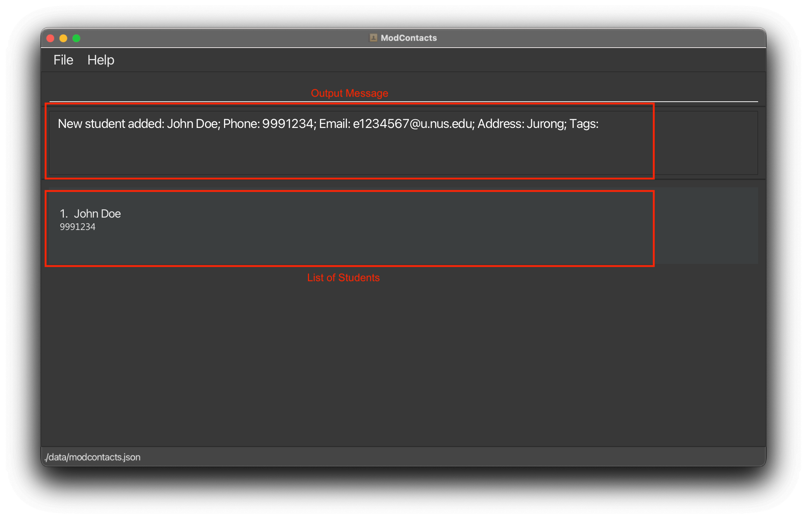

**On Error**

If the command is improperly formatted or certain parameters are missing the app will show what fields are needed and how a properly inputted command should look like.

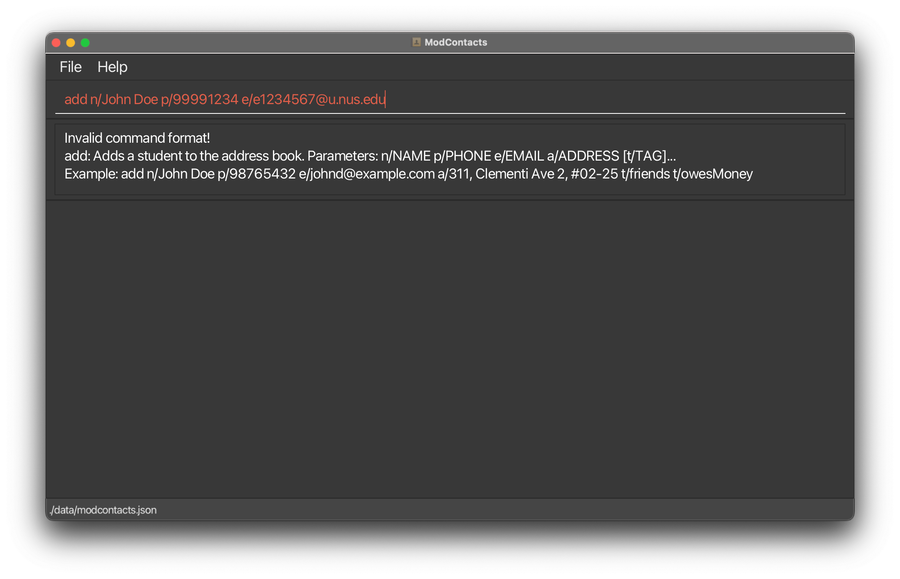

## Listing all friends : `list`

Shows a list of _all_ friends in the ModContacts list. You would need this command as sometimes you might commands (i.e `find`) which shows a filtered list instead of the entire list.

Format: `list`

**On Success**

A message should appear saying that all friends are being listed.


## Editing a friend : `edit`

Edits an existing friend in the mod contacts list.

Format: `edit INDEX [n/NAME] [p/PHONE] [e/EMAIL] [a/ADDRESS] [t/TAG]…​`

- Edits the friend at the specified `INDEX`. The index refers to the index number shown in the displayed friend list. The index **must be a positive integer** 1, 2, 3, …​
- At least one of the optional fields must be provided.
- Existing values will be updated to the input values.
- When editing tags, the existing tags of the friend will be removed i.e adding of tags is not cumulative.
- You can remove all the friend’s tags by typing `t/` without
  specifying any tags after it.

Examples:

- `edit 1 p/91234567 e/johndoe@example.com` Edits the phone number and email address of the 1st friend to be `91234567` and `johndoe@example.com` respectively.
- `edit 2 n/Betsy Crower t/` Edits the name of the 2nd friend to be `Betsy Crower` and clears all existing tags.

**Before command**

Suppose you want to edit a friend's name (Like _John Doe_ who we added in this [add](#adding-a-friend-add) example)

Let's change his name from `John Doe` to `Johnathan Doe`.

Type the following command:
`edit 1 n/Johnathan Doe`


**On Success**

If the command is inputted the correctly, a message should appear informing you that the command was successful and your friend's name has been edited.

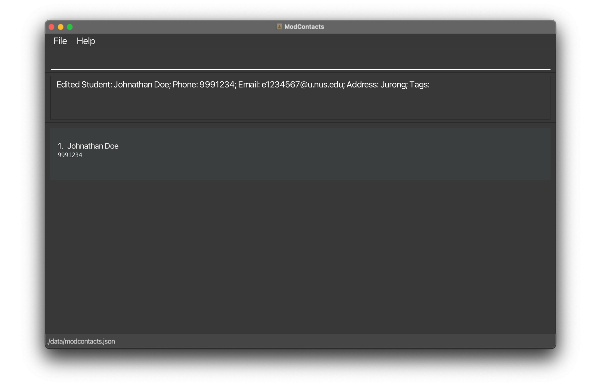

**On Error**

If the command is improperly formatted or certain parameters are missing the app will show what fields are needed and how a properly inputted command should look like. In this example we've accidentally written our `name` parameter as `nn/..` instead of `n/..`


## Adding a Module: `add_module`

Adds a module to your friend in the mod contacts list.

Format: `add_module i/INDEX m/MODULE_CODE`

- The `INDEX` refers to the index number shown in the displayed friend list. The index must be a positive integer 1, 2, 3, ...
- The `MODULE_CODE` refers to the module code of the module you intend to add

<div markdown="span" class="alert alert-primary">:bulb: **Tip:**
  If you are unsure of a module code, you can use [List Modules](#learn-more-about-modules-list_modules) to find it!
</div>

Examples:

- `add_module i/1 m/MA2001` Adds the module MA2001 to the 1st friend

**Before command**

Suppose you want to add a module to the 1st friend on your list

Let's add `CS2101` to them!

Type the following command:
`add_module i/1 m/CS2101`


**On Success**

If the command is inputted the correctly, a message should appear informing you that the command was successful and the module has been added.


**On Error**

If the command is improperly formatted or certain parameters are missing the app will show what fields are needed and how a properly inputted command should look like. In this example we've added a non-existent module code `MA200002`.


<div markdown="span" class="alert alert-warning">:bulb: **Reminder:**
Module codes that aren't found in **NUSMods** will be considered invalid.
</div>

## Deleting a Module: `delete_module`

Deletes a module from your friend in the mod contacts list.

Format: `delete_module i/INDEX m/MODULE_CODE`

- The `INDEX` refers to the index number shown in the displayed friend list. The index must be a positive integer 1, 2, 3, ...
- The `MODULE_CODE` refers to the module code of the module you intend to delete

Examples:

- `delete_module i/1 m/MA2001` Deletes the module MA2001 to the 1st friend

**Before command**

Suppose you want to delete a module from the 1st friend on your list

Let's remove `CS2101`

Type the following command:
`delete_module i/1 m/CS2101`


**On Success**

If the command is inputted the correctly, a message should appear informing you that the command was successful and the module has been deleted. The changes should be reflected on the list as well.


**On Error**

If the command is improperly formatted or certain parameters are missing the app will show what fields are needed and how a properly inputted command should look like. In this example we are trying to delete the module `CS2109` which was never added to the friend.

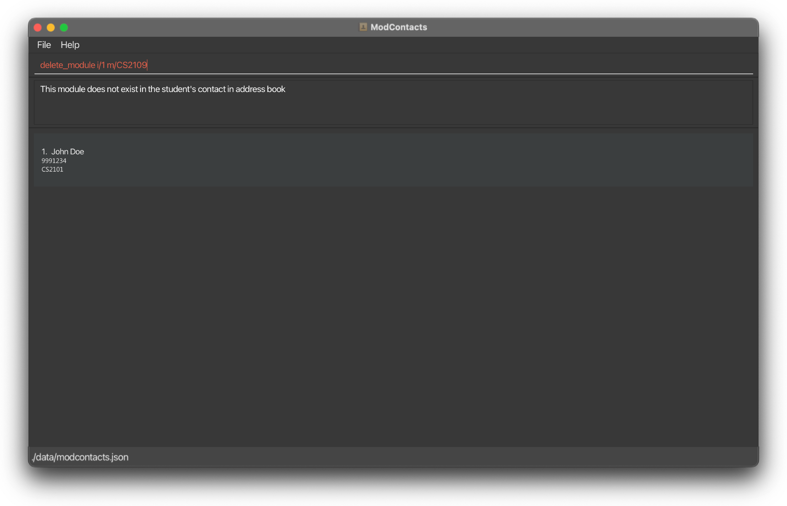

## Adding a Module Timing: `add_timing`

Adds a module's class timing to your friend in the mod contacts list.

Format: `add_timing i/INDEX m/MODULE_CODE d/DAY st/START_TIME et/END_TIME`

* The `INDEX` refers to the index number shown in the displayed student list. The index must be a positive integer 1, 2, 3, ...
* The `MODULE_CODE` refers to the module code of the module you intend to add
* The `DAY` refers to the day of the class, i.e. Mon, Tue, Wed, Thu, Fri, Sat, Sun (This is case-sensitive!)
* The `START_TIME` refers to the start time of the class i.e. 0800, 1230, 1845, 2300
* The `END_TIME` refers to the end time of the class i.e. 0900, 1430, 2045, 2359

<div markdown="span" class="alert alert-warning">:bulb: **Reminder:**
You need to [add the module first](#adding-a-module-add_module) before you add the timing.
</div>

Examples:

- `add_timing i/1 m/MA2001 d/Mon st/1200 et/1400` Adds a 1200h – 1400h timing for the module MA2001 to the 1st friend

**Before command**

Suppose you want to add the timing `1600h – 1800h` to the `CS2101` module for your 1st friend on the list

Type the following command:
`add_timing i/1 m/CS2101 d/Wed st/1600 et/1800`


**On Success**

If the command is inputted the correctly, a message should appear informing you that the command was successful and the timing has been added. The changes should be reflected on the list as well.

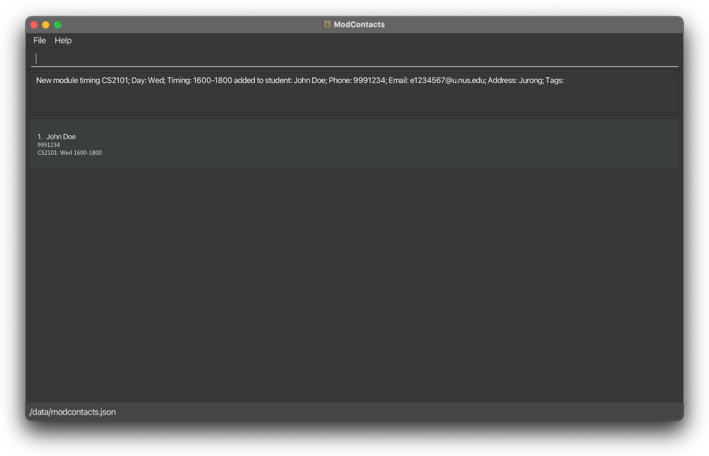

**On Error**

If the command is improperly formatted or certain parameters are missing the app will show what fields are needed and how a properly inputted command should look like. In this example we used an incorrect time format (12h instead of 24h).

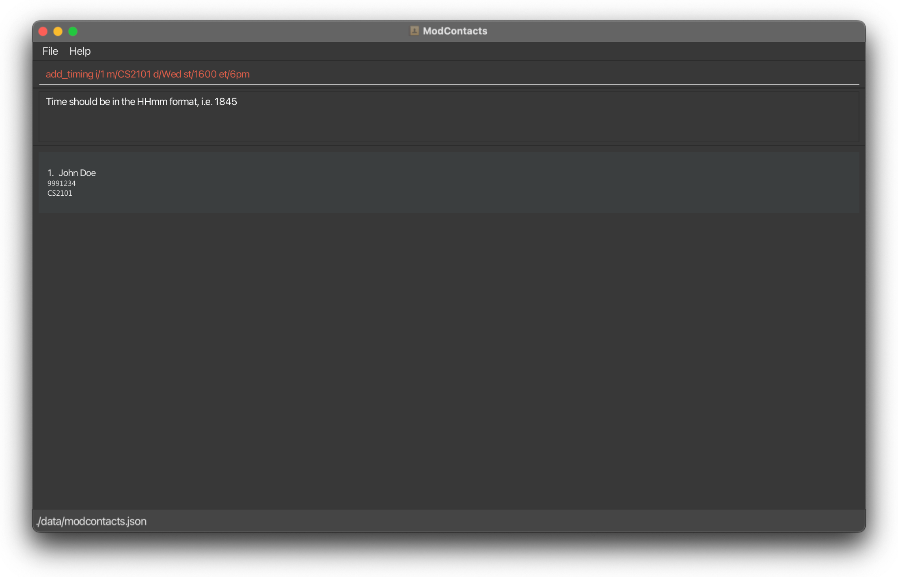

## Deleting a Module Timing: `delete_timing`

Deletes a module's class timing from your friend in the mod contacts list.

Format: `delete_timing i/INDEX m/MODULE_CODE d/DAY st/START_TIME et/END_TIME`

* The `INDEX` refers to the index number shown in the displayed student list. The index must be a positive integer 1, 2, 3, ...
* The `MODULE_CODE` refers to the module code of the module you intend to add
* The `DAY` refers to the day of the class, i.e. Mon, Tue, Wed, Thu, Fri, Sat, Sun (This is case-sensitive!)
* The `START_TIME` refers to the start time of the class i.e. 0800, 1230, 1845, 2300
* The `END_TIME` refers to the end time of the class i.e. 0800, 1230, 1845, 2300

Examples:

- `delete_timing i/1 m/MA2001 d/Mon st/1200 et/1400` Deletes the 1200h – 1400h timing for the module MA2001 to the 1st friend

**Before command**

Suppose you want to delete the timing `1600h – 1800h` to the `CS2101` module for your 1st friend on the list

Type the following command:
`delete_timing i/1 m/CS2101 d/Wed st/1600 et/1800`


**On Success**

If the command is inputted the correctly, a message should appear informing you that the command was successful and the timing has been deleted. The changes should be reflected on the list as well.

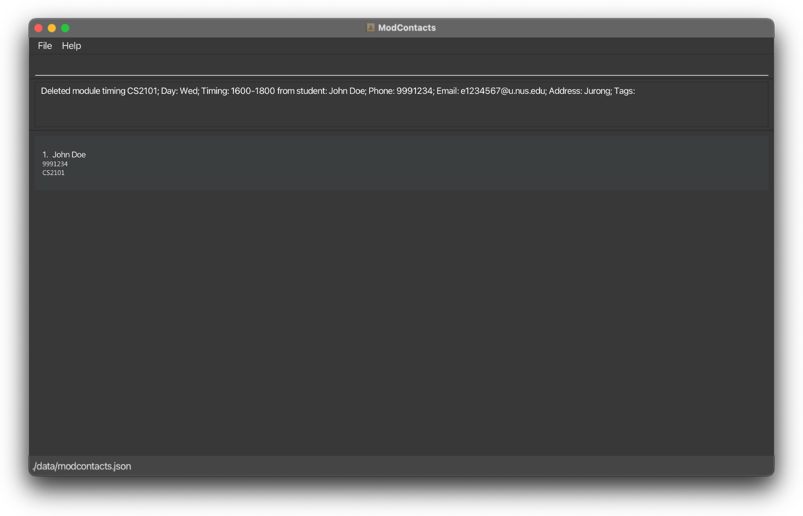

**On Error**

If the command is improperly formatted or certain parameters are missing the app will show what fields are needed and how a properly inputted command should look like. In this example we inputted the wrong day (It should be `Wed` and not `Thu`) for the timing that we previously added.

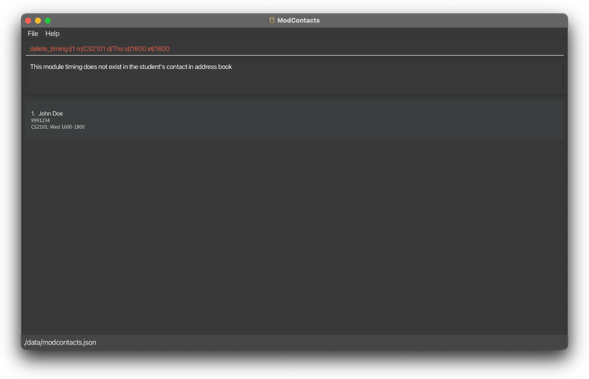

## Locating friends by name: `find`

Finds friends whose names contain any of the given keywords.

Format: `find KEYWORD [MORE_KEYWORDS]`

- The search is case-insensitive. e.g `hans` will match `Hans`
- The order of the keywords does not matter. e.g. `Hans Bo` will match `Bo Hans`
- Only the name is searched.
- Only full words will be matched e.g. `Han` will not match `Hans`
- Friends matching at least one keyword will be returned (i.e. `OR` search).
  e.g. `Hans Bo` will return `Hans Gruber`, `Bo Yang`

Examples:

- `find John` Finds a friend whose name contains `John`

**Before command**

Suppose you want to find your friend `John Doe`

Type the following command:
`find John`

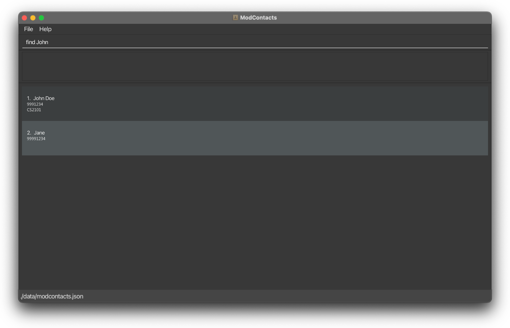

**On Success**

If the command is inputted the correctly, a message should appear informing you that the command was successful and how many friends whose names contains the keyword you are searching. A filtered list will then be shown showing who matches the name you are searching for.

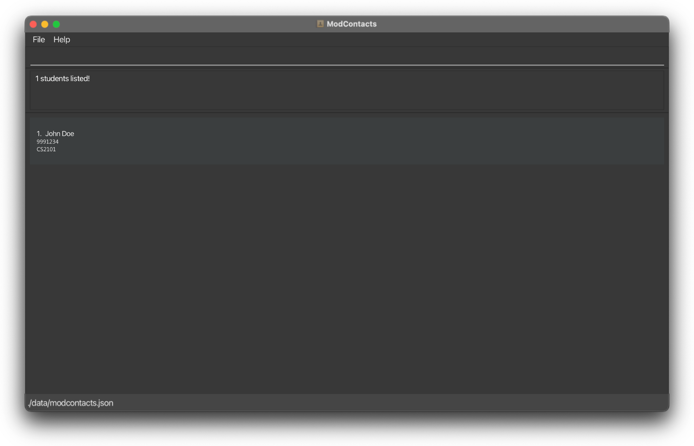

**On Error**

If the command is improperly formatted or certain parameters are missing the app will show what fields are needed and how a properly inputted command should look like. In this example we did not include the keyword to search for.

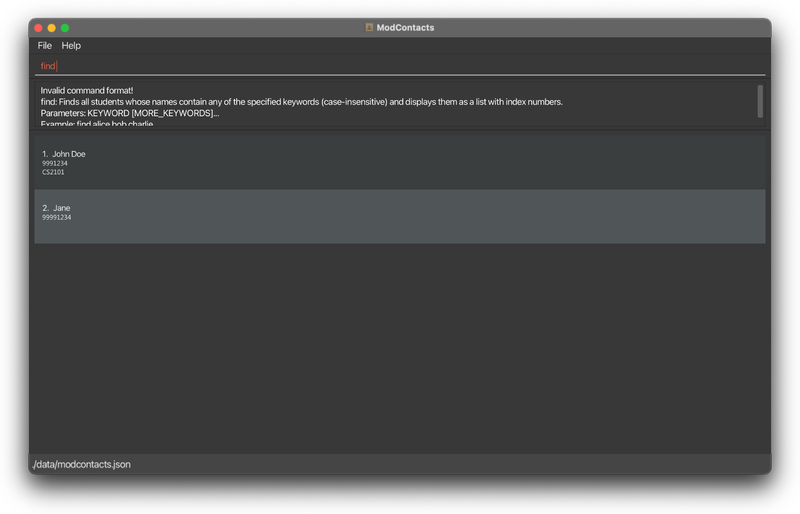

## Find friends who are free to meet: `find_free_time`

Finds friends who are free at this given time period.

Format: `find_free_time d/DAY st/START_TIME et/END_TIME`

* The `DAY` refers to the day of the class, i.e. Mon, Tue, Wed, Thu, Fri, Sat, Sun (This is case-sensitive!)
* The `START_TIME` refers to the start time of the class i.e. 0800, 1230, 1845, 2300
* The `END_TIME` refers to the end time of the class i.e. 0900, 1430, 2045, 2359

Examples:

- `find_free_time d/Wed st/1500 et/1600` Find a list of friends who are free on **Wednesday 1500h – 1600h**

**Before command**

Suppose you are free on **Monday 1200h – 1300h** and you would like to find out which friends are free as well.
Your two friends `Alice` and `Bob` are on ModContacts and these are their current schedules on **Monday**.

- `Alice` has a lesson from **1000h - 1200h**
- `Bob` has a lesson from **1100h - 1300h**


Type the following command:
`find_free_time d/Mon st/1200 et/1300`


**On Success**

If the command is inputted the correctly, a message should appear informing you that the command was successful and how many friends whose names contains the keyword you are searching. A filtered list will then be shown showing which friends are free in the stipulated time.

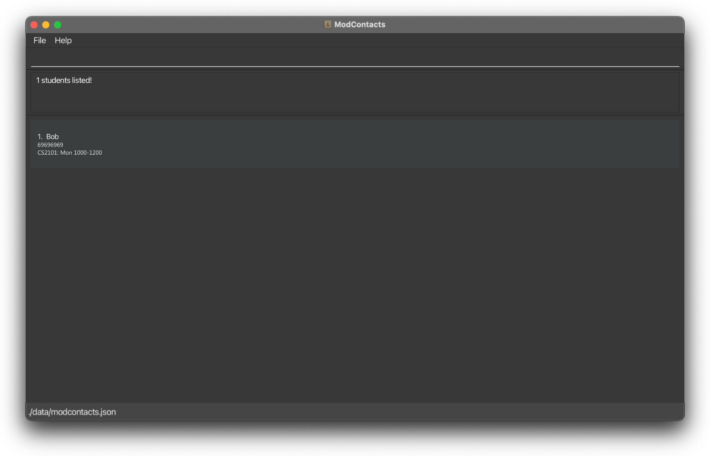

**On Error**

If the command is improperly formatted or certain parameters are missing the app will show what fields are needed and how a properly inputted command should look like. In this example we did not key in the day in the proper format (`Monday` instead of `Mon`)


## Learn more about modules: `list_modules`

List Modules allows you to search for the available modules in NUS and get its description.

Format: `list_modules m/MODULE_CODE`

* The `MODULE_CODE` refers to the *prefix* or the first few characters of the module you intend to search. This search **case insensitive**, which means searching with `m/CS2103` and `m/cs2103` will yield the same results.

For example, you can search for all modules starting with `CS21` with the command `list_modules m/cs21` and it will list all modules in NUS starting with the given module code.

<div markdown="span" class="alert alert-primary">:bulb: **Tip:**
This command is useful when you're adding a friend to the addressbook. If you only remember the first few characters of their module code, you can search it up and read the descriptions to identify the correct module.
</div>


<div markdown="span" class="alert alert-warning">:exclamation: **Caution:**

If no valid modules are found, the message "No modules found with prefix `[MODULE_CODE]`" will be displayed.
</div>

## Find friends with modules: `module_search`

Looking for buddies to discuss schoowork? Finds friends who are taking the specified module.

Format: `module_search m/MODULE_CODE`

* The `MODULE_CODE` refers to the **FULL** module you intend to search. This is `case insensitive`, which means searching with `m/CS2103T` and `m/cs2103T` will yield the same results.

<div markdown="span" class="alert alert-primary">:bulb: **Tip:**
If you cannot remember the full module code, [list_modules](#learn-more-about-modules-list_modules) can be used to find the correct module
</div>


<div markdown="span" class="alert alert-warning">:exclamation: **Caution:**

If no friends are found with the specified module, the message "0 students listed" will be displayed.

However, if an invalid module code is given, an error message will show up, informing you that the module code is invalid and a valid module code can be found using the `list_modules` command.
</div>

## Deleting a friend : `delete`

Deletes the specified friend from the mod contacts list.

Format: `delete INDEX`

- Deletes the friend at the specified `INDEX`.
- The index refers to the index number shown in the displayed friend list.
- The index **must be a positive integer** 1, 2, 3, …​

Examples:

- `list` followed by `delete 2` deletes the 2nd friend in the mod contacts list.
- `find Betsy` followed by `delete 1` deletes the 1st friend in the results of the `find` command.

## Clearing all entries : `clear`

Clears all entries from the mod contacts list.

Format: `clear`

## Exiting the program : `exit`

Exits the program.

Format: `exit`

---
<div style="page-break-after: always;"></div>
# FAQ

**Q**: How do I transfer my data to another Computer?<br>
**A**: Install the app in the other computer and overwrite the empty data file it creates with the file that contains the data of your previous ModContacts home folder.

**Q**: How do I know if my data is saved?<br>
**A**: ModContacts data are saved in the hard disk automatically after any command that changes the data. There is no need to save manually.

**Q**: Can I manually edit the data file?<br>
**A**: ModContacts data are saved automatically as a JSON file `[JAR file location]/data/modcontacts.json`. Advanced users are welcome to update data directly by editing that data file.

<div markdown="span" class="alert alert-warning">:exclamation: **Caution:**
If your changes to the data file makes its format invalid, ModContacts will discard all data and start with an empty data file at the next run. Hence, it is recommended to take a backup of the file before editing it.<br>
Furthermore, certain edits can cause the ModContacts to behave in unexpected ways (e.g., if a value entered is outside of the acceptable range). Therefore, edit the data file only if you are confident that you can update it correctly.
</div>

---
<div style="page-break-after: always;"></div>
# Glossary

| Glossary Term | Definition                                                                                                                  |
| --- | --- |
| CLI           | Command Line Interface, the text-based interface for interacting with ModContacts.                                          |
| GUI           | Graphical User Interface, the visual interface for interacting with ModContacts.                                            |
| Command       | The instruction given to ModContacts to perform a specific action.                                                          |
| Prefix        | A **1** letter keyword, with a `/` at the end, such as `m/`, `i/` that is used to specify the type of data for the command. |
| NUS           | National University of Singapore, the university that ModContacts is designed for.                                          |
| SoC           | School of Computing, the faculty in NUS that ModContacts is designed for.                                                   |
| field         | A piece of information that can be added to a command. e.g. `n/John Doe` has the field John Doe, with the prefix `n/`.      |
| camel casing   | A casing format where words are not separated by whitespaces. Words are joined together and the first letter of each word, except the first one, is capital. Example: "thisIsCamelCasing" is "this is camel casing" in camel casing.

---

## Known issues

1. **When using multiple screens**, if you move the application to a secondary screen, and later switch to using only the primary screen, the GUI will open off-screen. The remedy is to delete the `preferences.json` file created by the application before running the application again.

---
# Command summary

| Action                                                                    | Format, Examples                                                                                                                                                      |
| ------------------------------------------------------------------------- | --------------------------------------------------------------------------------------------------------------------------------------------------------------------- |
| **Help**                                                                  | `help`                                                                                                                                                                |
| [**Add**](#adding-a-module-add_module)                                    | `add n/NAME p/PHONE_NUMBER e/EMAIL a/ADDRESS [t/TAG]…​` <br> e.g., `add n/James Ho p/22224444 e/jamesho@example.com a/123, Clementi Rd, 1234665 t/friend t/colleague` |
| [**List**](#listing-all-students--list)                                   | `list`                                                                                                                                                                |
| [**Edit**](#editing-a-student--edit)                                      | `edit INDEX [n/NAME] [p/PHONE_NUMBER] [e/EMAIL] [a/ADDRESS] [t/TAG]…​`<br> e.g.,`edit 2 n/James Lee e/jameslee@example.com`                                           |
| [**Delete**](#deleting-a-module-delete_module)                            | `delete INDEX`<br> e.g., `delete 3`                                                                                                                                   |
| [**Add Module**](#adding-a-module-add_module)                             | `add_module i/INDEX m/MODULE_CODE`<br> e.g., `add_module i/1 m/CS2103T`                                                                                               |
| [**Delete Module**](#deleting-a-module-delete_module)                     | `delete_module i/INDEX m/MODULE_CODE`<br> e.g., `delete_module i/1 m/MA2001`                                                                                          |
| [**Add Timing**](#adding-a-module-timing-add_timing)                      | `add_timing i/INDEX m/MODULE_CODE d/DAY st/START_TIME et/END_TIME`<br> e.g., `add_timing i/1 m/MA2001 d/Mon st/1200 et/1400`                                          |
| [**Delete Timing**](#deleting-a-module-timing-delete_timing)              | `delete_timing i/INDEX m/MODULE_CODE d/DAY st/START_TIME et/END_TIME`<br> e.g., `delete_timing i/1 m/MA2001 d/Mon st/1200 et/1400`                                    |
| [**Find**](#locating-students-by-name-find)                               | `find KEYWORD [MORE_KEYWORDS]`<br> e.g., `find James Jake`                                                                                                            |
| [**Find Free Timing**](#find-friends-who-are-free-to-meet-find_free_time) | `find_free_time d/DAY st/START_TIME et/END_TIME`<br> e.g., `find_free_time d/Wed st/1500 et/1600`                                                                     |
| [**List Modules**](#learn-more-about-modules-list_modules)                | `list_modules m/MODULE_CODE` <br> e.g. `list_modules m/cs21`                                                                                                          |
| [**Search Module**](#find-friends-with-modules-module_search)             | `search m/MODULE_CODE` <br> e.g. `search m/CS2103T`                                                                                                                   |
| [**Clear**](#clearing-all-entries--clear)                                 | `clear`                                                                                                                                                               |
| [**Exit**](#exiting-the-program--exit)                                    | `exit`                                                                                                                                                                |
